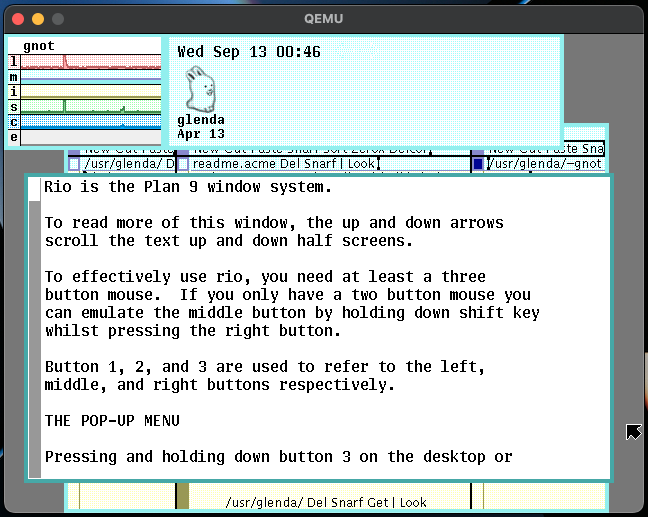

# tinkering

## Booting Plan 9 on QEMU

If you'd like to try Plan 9 using QEMU, use the script in s/virt9.sh to run it.

The scripts requires two arguments: the path to the **ISO file** (see [links.md](links.md) for the download link) and the path to the **QEMU disk image**. It is recommended a **30 GB** qcow2 image for disk and the original Plan 4 4th edition, instead of a fork (e.g. 9front), for an original experience.

```
./s/virt9.sh <iso> <disk>
```

If you run into errors, [this](http://fqa.9front.org/fqa3.html#3.3.1) can help.

## Boot prompts

While booting, a prompt similar to

```
root is from (tcp, local)[local!#S/sdC0/fossil]:
```

should appear. The suggested option ("local!#S/sdC0/fossil" in this case) should be good in almost all cases, so you just need to press Enter to confirm.

Next, another prompt appears, which asks for the user.

```
user[none]:
```

When booting the first time, the only existing user is **glenda**, which is the one you should use. The glenda user on Plan 9 is similar to the root user in Unix-like systems.

Pressing Enter without typing a user will result in a few errors and Rio won't start automatically.



### Setting default root and user

If the two boot prompts bother you, you can edit the [plan9.ini](https://p9f.org/magic/man2html/8/plan9.ini) file located in the 9fat partition. To do so, type the commands below.

```
9fs 9fat
cd /n/9fat
acme plan9.ini
```

- [`9fs`](https://p9f.org/magic/man2html/4/srv) mounts the 9fat partition. If you see an error like `srv: dial net!9fat!9fs: cs: ...`, you can safely ignore that.
- `cd` changes directory to the `9fat` partition
- [`acme`](https://p9f.org/magic/man2html/1/acme) opens the plan9.ini file using the acme editor

Now add the following lines anywhere you want in the file

```
nobootprompt=<root>
user=<user>
```

and replace `<root>` with the desired default root path (if you don't know it, write the one suggested on boot) and `<user>` with the default user (`glenda`, if you didn't create any other user). You can get a list of existing users with `lc /usr`.

Once you wrote the lines, middle-click (click with the mouse wheel) on "Put" and then on "Exit".

## Troubleshooting

### "No frame buffer"

If you run into the error below or a similar one

```
aux/vga: inportl(0xc100): permission denied
rio: can't open display: initdisplay: /dev/draw/new: no frame buffer
init: rc exit status: rio 31: display open
```

you have to type 2 commands:

```
aux/vga -m vesa -l
```

which initializes the screen (now you should see a new white prompt in a clear black screen), and start rio using

```
rio
```

([source](https://syndamia.com/tutorials/fix-no-frame-buffer-plan9/))
