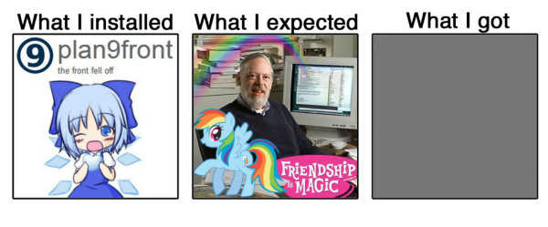

# 9knowledge

 

My notes about [9front](http://9front.org/).

## What?

[Plan 9 from Bell Labs](https://p9f.org/about.html) (or "Plan 9", for short) is an awesome research operating system which demonstrates how most of the software we use today is over-complicated and over-engineered.

Plan 9 follows the principles of the [Unix philosophy](https://en.wikipedia.org/wiki/Unix_philosophy), and--at a first glance--is similar to most contemporary Unix-like operating systems, like Linux and BSDs. However, on the other hand, Plan 9 cannot be thought of as a Unix-like operating system. It is a direct descendant of [Research Unix](https://en.wikipedia.org/wiki/Research_Unix) and takes Unix's ["everything is a file"](https://en.wikipedia.org/wiki/Everything_is_a_file) concept to the extreme. Now files are interfaces for text streams and the filesystem is not just a representation of data stored on the disk, but an interface for programs and users.

Although we could say that Plan 9 quietly--yet successfully--influenced modern computing (some aspects more than others; see [funfacts.md](funfacts.md)), the project itself was not successful at all. To use an unhappy euphemism, it was *born dead*. One of the reasons, probably the most significant, was its incompatibility with most of the hardware we currently use today. Plan 9 only implemented MBR, a BIOS interface, an in-memory frame buffer, and a bunch of CPU architectures. This was not really an issue at the time, because the operating system's purpose was to be "an argument for simplicity", as Rob Pike said. However, the principles were right, the experiment successful, the foundation robust, and the design functional. That's why a group of people forked it and currently maintains the project under the name of [9front](http://9front.org/), with useful changes and wider hardware support. Today, 9front represents one of the most advanced Plan 9 forks.

## Why?

I'm maintaining this repository with useful resources and links so that other people can learn more about Plan 9 and waste less time than I did.

## Where do I start?

If you have little to no experience with Plan 9 and 9front, start by getting familiar with Plan 9's [glossary](glossary.md). Then use [this](d2d.md) for day-to-day operations.

Also check [this](postinst.md) out for a bunch of stuff you may want to do after a clean installation of 9front.

I also keep track of interesting and useful [links](links.md).
